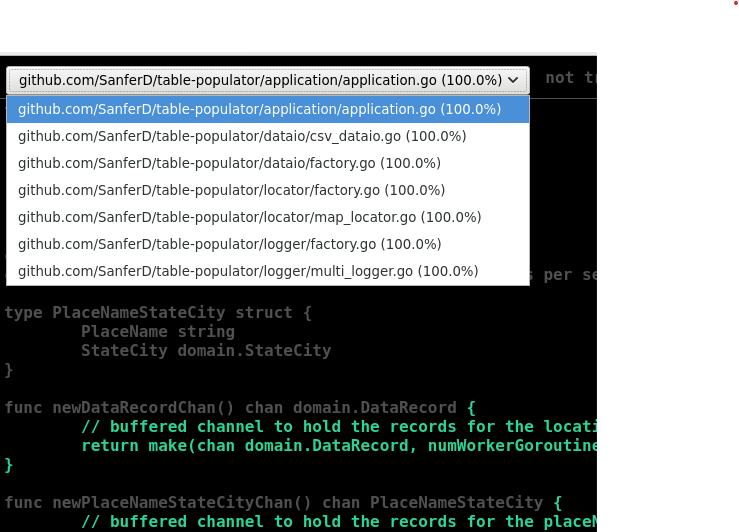

# Table Populator

# Introduction

An enterprise-y placeName to planeName,city,state translator,
which effectively reads placeName data from a csv file, extracts city and state using google maps api,
and creates an output csv file with placeName, city, state associated together.

- Uses Ports and Adaptors architecture
  - **domain**: Contains domain structures and interfaces (ports). Has no dependencies.
  - **application**: Performs the application logic over the domain. Only depends on the domain.
  - **logger**, **locator**, **dataio**: These implement the interfaces to interact with the outside world,
    i.e. are adapters to the ports found in the domain. Depends on **domain**, **config**.
  - **config**: Reads the configuration information found in `.env` configuration file.
  - **main**: Ties everything together.

# How to Run

- Configure environment. Then

```
make clean
make build
make run
make test
make coverage
```

Running `make coverage` presumes `gocovmerge` is installed:

```
go install github.com/wadey/gocovmerge@latest
```

Might need the following if `gocovmerge` is not found in syspath

```
export PATH=$PATH:$(go env GOPATH)/bin
```



## Example `.env` File

```
# API KEYS
MAPS_API_KEY=

# FILE PATHS
CSV_DATA_FILE_PATH=
OUTPUT_FILE_PATH=

# DATAIO
DATAIO_KIND="csv"

# LOCATOR
LOCATOR_KIND="google-maps"

# LOGGER
LOGGER_KIND="multi"
LOG_TO_STDOUT=1
LOG_FILE_PATH=
```

## Where to find Maps key

Navigate to google cloud console > APIs & Services > [Credentials](https://console.cloud.google.com/apis/credentials) and create a key restricted to **Places API**.

## Example Input Format

```
ignore1,ignore2,my-place-1,ignore3
ignore1,ignore2,my-place-2,ignore3
ignore1,ignore2,my-place-3,ignore3
```

## Example Output Format

```
my-place-1,city-1,state-1
my-place-2,city-2,state-2
my-place-3,city-3,state-3
```

## Example Execution Output

```
info:2024/02/14 15:51:57 reading records
info:2024/02/14 15:51:57 spawning goroutines to process data records
info:2024/02/14 15:51:57 spawning goroutine to populate output csv
debug:2024/02/14 15:51:58 goroutine 0 getting location for place-A
debug:2024/02/14 15:51:58 goroutine 2 getting location for place-B
debug:2024/02/14 15:51:58 goroutine 1 getting location for place-C
debug:2024/02/14 15:51:58 goroutine 2 fetched location for place-B
debug:2024/02/14 15:51:58 goroutine 0 fetched location for place-A
debug:2024/02/14 15:51:58 goroutine 1 fetched location for place-C
debug:2024/02/14 15:51:58 goroutine 2 getting location for place-D
debug:2024/02/14 15:51:58 goroutine 0 getting location for place-E
debug:2024/02/14 15:51:58 goroutine 1 getting location for place-F
debug:2024/02/14 15:51:58 writing place with city place-B
debug:2024/02/14 15:51:58 closing dataRecordsChan
debug:2024/02/14 15:51:58 writing place with city place-A
debug:2024/02/14 15:51:58 writing place with city place-C
debug:2024/02/14 15:51:59 goroutine 0 fetched location for place-E
debug:2024/02/14 15:51:59 goroutine 0 getting location for place-G
debug:2024/02/14 15:51:59 writing place with city place-E
debug:2024/02/14 15:51:59 goroutine 2 fetched location for place-D
debug:2024/02/14 15:51:59 goroutine 2 getting location for place-H
debug:2024/02/14 15:51:59 goroutine 1 fetched location for place-F
debug:2024/02/14 15:51:59 writing place with city place-D
debug:2024/02/14 15:51:59 writing place with city place-F
debug:2024/02/14 15:51:59 goroutine 1 getting location for place-I
debug:2024/02/14 15:51:59 goroutine 0 fetched location for place-G
debug:2024/02/14 15:51:59 goroutine 2 fetched location for place-H
debug:2024/02/14 15:51:59 writing place with city place-G
debug:2024/02/14 15:51:59 goroutine 2 done fetching locations
debug:2024/02/14 15:51:59 goroutine 0 done fetching locations
debug:2024/02/14 15:51:59 writing place with city place-H
debug:2024/02/14 15:51:59 goroutine 1 fetched location for place-I
debug:2024/02/14 15:51:59 goroutine 1 done fetching locations
debug:2024/02/14 15:51:59 writing place with city place-I
debug:2024/02/14 15:51:59 closing placeNameStateCityChan
debug:2024/02/14 15:51:59 waiting for all output records to be written
```

# Todos

- [x] Add unit tests
- [ ] Integration tests
- [ ] Acceptance tests
